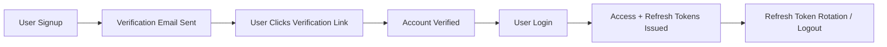

# 🚗 Parking Management API (GDG 2026 Capstone)

A robust backend service for managing parking spots, user authentication, and real-time reservations. Built with **Node.js**, **Express**, and **MongoDB**.

---

## 📑 Table of Contents

- [Project Overview](#-project-overview)
- [Project Structure](#-project-structure)
- [Technologies Used](#-technologies-used)
- [Environment Variables](#-environment-variables)
- [API Endpoints](#-api-endpoints)
- [Detailed Schema](#-detailed-schema)
- [Data Models](#-data-models)
- [Setup & Installation](#-setup--installation)

---

## 🌟 Project Overview

The **Parking Management API** is a backend service designed to handle the complexities of urban parking. It features secure JWT-based authentication with refresh token rotation, geospatial spot filtering using the Haversine formula, and atomic slot management.

---

## 📁 Project Structure

The project follows a modular MVC-like architecture for scalability:

```
├── config/
│   ├── database.js          # MongoDB connection logic
│   └── env.js               # Environment variable configuration
├── controllers/
│   ├── authController.js     # User login, signup, logout logic
│   ├── parkingController.js  # Parking spot CRUD & filtering
│   └── reservationController.js # Booking logic
├── errorHandler/
│   └── errorHandler.js      # Global error middleware
├── middleware/
│   ├── authentication.js    # JWT verification
│   └── autherization.js     # Role-based access control
├── models/
│   ├── parkingSpot.js       # Parking schema & pre-save hooks
│   ├── refreshToken.js      # Hashed token storage with TTL
│   ├── reservationModel.js  # Reservation records
│   └── userModel.js         # User schema with validation
├── routes/
│   ├── authRoute.js         # /api/v1/auth
│   ├── parkingRoute.js      # /api/v1/parking-spots
│   └── reservationRoute.js  # /api/v1/reserve
├── utils/
│   └── sendEmail.js   # Email service (Nodemailer)
├── validation/
│   └── userValidation.js    # Joi/Validation schemas
├── .env                     # Local environment secrets
├── app.js                   # Express app setup & middleware
└── server.js                # Server entry point
```

---

# 🛠 Technologies Used

Runtime: Node.js (ES Modules)

Framework: Express.js

Database: MongoDB with Mongoose ODM

Security: JWT, Bcrypt, Helmet, CORS

Logging: Morgan

---

# 🔑 Environment Variables

Create a .env file in the root directory:

```
# .env
PORT=5000
MONGO_URI=your_mongodb_connection_string
CLIENT_URL=http://localhost:3000
ACCESS_TOKEN_SECRET_KEY=your_access_secret
REFRESH_TOKEN_SECRET_KEY=your_refresh_secret
ACCESS_TOKEN_EXPIRES_IN=15m
REFRESH_TOKEN_EXPIRES_IN=90d
EMAIL_USER=your_email@gmail.com
EMAIL_PASS=your_app_password
```

---

# 🔗 API Endpoints

---

1. Authentication (/api/v1/auth)

| Method   | Endpoint                 | Description                            | Auth Required |
| :------- | :------------------------| :--------------------------------------| :------------ |
| **POST** | `/register`              | Create a new user account              | ❌            |
| **POST** | `/login`                 | Login and receive tokens               | ❌            |
| **POST** | `/refresh`               | Get new Access Token via Refresh Token | ❌            |
| **POST** | `/logout`                | Invalidate current refresh token       | ✅            |
| **GET**  | `/me`                    | Retrieve current user profile          | ✅            |
| **GET**  | `/verify-email/:token`   | Verify email                           | ❌            |
| **POST**  | `/forgot-password`      | Send reset link                        |  ❌           |
| **POST**  | `/reset-password/:token`| Reset password                         | ❌            |

---

2. Parking Spots (/api/v1/parking-spots)

| Method     | Endpoint | Description                                | Auth Required |
| :--------- | :------- | :----------------------------------------- | :------------ |
| **GET**    | `/`      | Get active spots (Supports lat/lng filter) | ❌            |
| **GET**    | `/:id`   | Get specific parking spot by ID            | ❌            |
| **POST**   | `/`      | Create a new parking spot                  | ✅ (Admin)    |
| **PUT**    | `/:id`   | Update parking spot details                | ✅ (Admin)    |
| **DELETE** | `/:id`   | Soft-delete a parking spot                 | ✅ (Admin)    |

---

3. Reservations (/api/v1/reserve)

| Method   | Endpoint   | Description                              | Auth Required |
| :------- | :--------- | :--------------------------------------- | :------------ |
| **POST** | `/reserve` | Reserve a slot (Decrements availability) | ✅            |

---

# 📋 Detailed Schema (Body Requirements)

---



---

# Authentication

---

Signup/Register

```
JSON
{
"fullName": "John Doe",
"email": "john@example.com",
"password": "securePassword123",
"role": "user"
}
```

---

Email Verification

GET /verify-email/:token

```
Response

{
  "message": "Email verified successfully"
}
```

---

```
Error Response

{
  "error": "Invalid or expired token"
}
```

---

```
Response:

{
  "message": "user created successfully",
  "data": {
    "_id": "64fbe97a2c5b2f0012345678",
    "fullName": "John Doe",
    "email": "john@example.com",
    "role": "user",
    "createdAt": "2026-04-04T18:00:00.000Z",
    "updatedAt": "2026-04-04T18:00:00.000Z"
  },
  "accessToken": "<JWT_ACCESS_TOKEN>",
  "refreshToken": "<JWT_REFRESH_TOKEN>"
}
```

---

```
Login

JSON
{
"email": "john@example.com",
"password": "securePassword123"
}
```

---

```
Response:

{
  "message": "user created successfully",
  "data": {
    "_id": "64fbe97a2c5b2f0012345678",
    "fullName": "John Doe",
    "email": "john@example.com",
    "role": "user",
    "createdAt": "2026-04-04T18:00:00.000Z",
    "updatedAt": "2026-04-04T18:00:00.000Z"
  },
  "accessToken": "<JWT_ACCESS_TOKEN>",
  "refreshToken": "<JWT_REFRESH_TOKEN>"
}
```

---

---

# Parking & Reservations

Create Parking Spot

```
JSON
{
"name": "Main St Garage",
"latitude": 9.03,
"longitude": 38.74,
"totalSlots": 100,
"address": "123 Main St, Addis Ababa"
}
```

---

```
Response:
{
  "success": true,
  "message": "Parking spots retrieved successfully",
  "data": [
    {
      "id": "64fc0b5f2c5b2f001234abcd",
      "name": "Main St Garage",
      "latitude": 9.03,
      "longitude": 38.74,
      "availableSlots": 49,
      "totalSlots": 100,
      "address": "123 Main St, Addis Ababa",
      "distanceKm": 1.2
    }
  ]
}
```

---

---

Reserve Spot

```
JSON
{
"userId": "64f...",
"parkingId": "64f..."
}
```

---

```
Response:
{
  "success": true,
  "message": "Reservation confirmed",
  "reservationId": "64fc0c6f2c5b2f001234efgh",
  "availableSlots": 19
}
```

---

# 📊 Data Models

---

# User

---

fullName: String (Required)

email: String (Unique, validated format)

password: String (Hashed via Bcrypt)

role: Enum ["user", "admin"] (Default: "user")

---

# ParkingSpot

latitude / longitude: Numbers (Required for proximity search)

totalSlots: Number (Total capacity)

availableSlots: Number (Remaining capacity; auto-managed)

isActive: Boolean (Used for soft-deletion)

---

# 💻 Setup & Installation

Clone & Enter:

```
Bash
git clone https://github.com/TOT8894/GDG-2026-Capstone-Project-Parking-Spot-Finder.git
cd GDG-2026-Capstone-Project-Parking-Spot-Finder
```

---

```
Install Dependencies:

Bash
npm install

Bash
npm run dev
```

---

The API will run at https://gdg-2026-capstone-project-parking-spot.onrender.com
---
